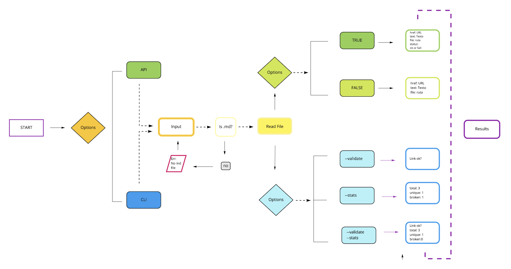

<div style="text-align: justify">  

# Proyecto: Markdown Links
#  Back- End 

## Autora : Alejandra Olea 

## Objetivo General: 
* Usando [Node.js] crear una herramienta que analice archivos en formato `Markdown` verifique los links que contenga y reporte estadísticas.


### Esta funcionalidad ofrece dos alternativas de uso:

### 1) **  JavaScript API **  Módulo puede importarse en otros scripts de Node.js con la interfaz:
```sh
* mdLinks(path, options).  options = true or false.
```
```sh
Con `validate:false` :
* `href`: URL encontrada.
* `text`: Texto que aparecía dentro del link (`<a>`).
* `file`: Ruta del archivo donde se encontró el link.
```

```sh
Con `validate:true` :
* `href`: URL encontrada.
* `text`: Texto que aparecía dentro del link (`<a>`).
* `file`: Ruta del archivo donde se encontró el link.
* `status`: Código de respuesta HTTP.
* `ok`: Mensaje `fail` en caso de fallo u `ok` en caso de éxito.
```

### 2) ** CLI ** Usando la interfaz de Línea de Comando de la terminal con las siguientes opciones:
```sh
### md-links <path-to-file> [options]
```
```sh
* $ md-links ./some/example.md --validate
* Petición HTTP para averiguar si el link responde ok.
./some/example.md http://algo.com/2/3/ ok 200 Link a algo
```

```sh
* $ md-links ./some/example.md --stats --
* Total: 3
* Unique: 3
* Broken: 0
```

```sh
* Se puede usar `--stats` y `--validate` jutos para obtener ambas estadísticas.
$ md-links ./some/example.md --stats --validate
*Total: 3
*Unique: 3
*Broken: 1
```

### Diagrama de flujo




</div>


